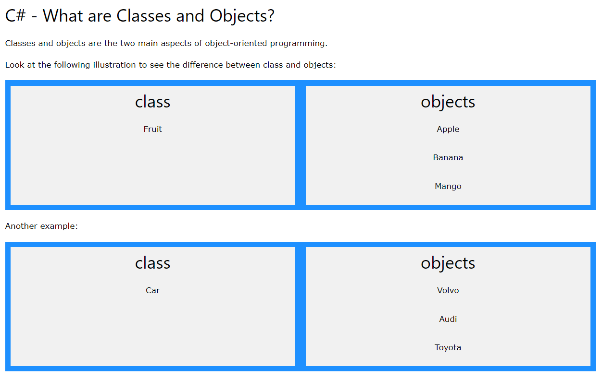
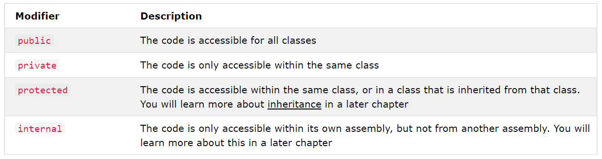

# C#
C# is a general-purpose, multi-paradigm programming language encompassing static typing, strong typing, lexically scoped, imperative, declarative, functional, generic, object-oriented, and component-oriented programming disciplines.

## Classes and objects.
Everything in C# is associated with classes and objects, along with its attributes and methods. 
### For example: 
* In real life, a **car is an object**. The car has **attributes**, such as *weight and color, and methods, such as drive and brake*.
* **A Class** is like an object `constructor`, or a "blueprint" for creating objects.


## Modifiers.

## Properties and Encapsulation.
**Encapsulation**, is to make sure that *"sensitive" data is hidden from users*. To achieve this, you must:
* declare fields/variables as `private`
* provide `public` `get` and `set` methods, through **properties**, to access and update the value of a `private` field

A **property** is like a combination of a variable and a method, and it has two methods: a get and a set method:
### Example.
```c#
class Person
{
  private string name; // field

  public string Name   // property
  {
    get { return name; }   // get method
    set { name = value; }  // set method
  }
}
```
### Explained...
* The `Name` property is associated with the `name` field. It is a good practice to use the same name for both the property and the `private` field, but with an uppercase first letter.
* The `get` method returns the value of the variable name.
* The `set` method assigns a value to the name variable. The value keyword represents the value we assign to the property.

## Why Encapsulation?
* **Better control of class members** (reduce the possibility of yourself (or others) to mess up the code)
* **Fields can be made read-only** (if you only use the get method), or **write-only** (if you only use the set method)
* **Flexible**: the programmer can change one part of the code without affecting other parts
* Increased security of data

## Inheritance (Derived and Base Class).
It is possible to **inherit fields** and **methods** from one class to another. We group the "inheritance concept" into two categories
* **Derived Class (child)** - the class that inherits from another class.
* **Base Class (parent)** - the class being inherited from.

To inherit from a class, use the `:` symbol.

## Polymorphism and Overriding Methods.
Polymorphism means "many forms", and it occurs when we have many classes that are related to each other by inheritance.
*  **Inheritance** lets us inherit fields and methods from another class. **Polymorphism** uses those methods to perform different tasks. This allows us to perform a single action in different ways.
### Example...
Think of a base class called Animal that has a method called animalSound(). Derived classes of Animals could be Pigs, Cats, Dogs, Birds - And they also have their own implementation of an animal sound (the pig oinks, and the cat meows, etc.)
